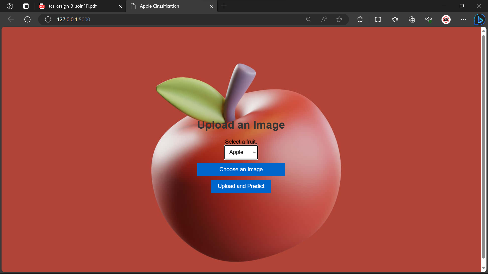

# Fruit Defect Detection

Fruit Defect Detection is a web application that allows users to upload images of various fruits (e.g., apples, bananas, oranges) and receive predictions on the fruit's quality (e.g., fresh or rotten). The application uses deep learning models to perform fruit classification based on the selected fruit type.



## Features

- Fruit Selection: Users can select the type of fruit they want to classify (apple, banana, or orange) using a dropdown menu.
- Image Upload: Users can upload an image of the selected fruit.
- Real-time Prediction: The application provides real-time predictions on the fruit's quality (fresh or rotten).
- User-Friendly Interface: The user interface is intuitive and easy to use.

## Getting Started

Follow these steps to set up and run the Fruit Defect Detection web application locally:

1. Clone the repository to your local machine:

   ```bash
   git clone https://github.com/surajmohityadav/fruit-defect-detection.git


2. Install the required Python packages:

   ```bash
   pip install -r requirements.txt


3. Run the Flask application:

   ```bash
   python app.py


Access the application in your web browser at http://localhost:5000.

Usage
Select a fruit type (apple, banana, or orange) from the dropdown menu.

Choose an image of the selected fruit by clicking on "Choose an Image" and then upload the image.

Click the "Upload and Predict" button to receive a prediction on the fruit's quality.

The application will display whether the fruit is "Fresh" or "Rotten."

Folder Structure
templates/: Contains HTML templates.
uploads/: Stores uploaded images.
models/: Contains pre-trained deep learning models.
static/: Stores static files (e.g., CSS, JavaScript).
app.py: The main Flask application.
Credits
TensorFlow: Used for deep learning and image classification.
Flask: Used for building the web application.
Bootstrap: Used for styling the user interface.
License
This project is licensed under the MIT License - see the LICENSE file for details.

